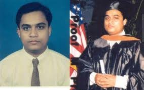
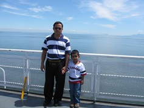
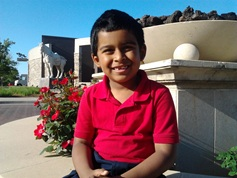

# personal
Created by Dr. Zaman. June 2026.
# This repository is to store personal materials such as photographs and video clips.

## Video Demonstration

   
Abu Asaduzzaman (1993-1997) &nbsp;&nbsp;&nbsp;&nbsp;&nbsp;&nbsp;&nbsp;&nbsp;
&nbsp;&nbsp;&nbsp;&nbsp;&nbsp;&nbsp;&nbsp; Abu and Rayan in Canada (2011) &nbsp;&nbsp;&nbsp;&nbsp;&nbsp;
&nbsp;&nbsp;&nbsp;&nbsp;&nbsp; Rayan in Wichita (2014)  
  
Abu - Sunset and Sunrise (2024): https://www.youtube.com/watch?v=xrvSG8sKKPc  
Abu - December 26th of 2022 (2022): https://www.youtube.com/watch?v=srWaQ-MoCV4  
Abu - Death Makes Dreams True? (2021): https://www.youtube.com/watch?v=vvN55jXaMVo  
Abu - I Saw Her Last Night (2011): https://www.youtube.com/watch?v=kxtcwEIlqfo  
Rayan - National Merit Scholarship (2025-2026): https://www.youtube.com/watch?v=dTQ9_4KxXmI  
Rayan - Mago ma (2012): https://www.youtube.com/watch?v=Xs2TdbBGY38  
